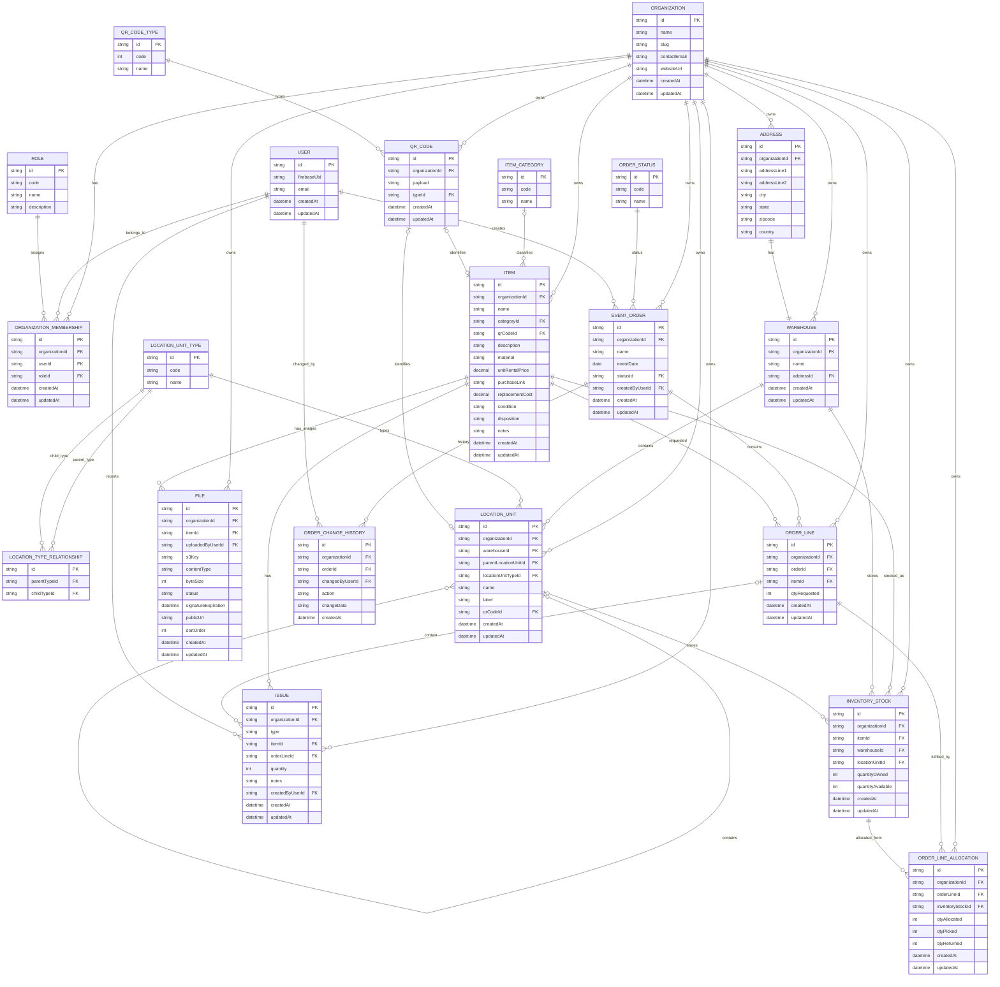

# ERD - ASE WMS

**Status:** Draft for MVP Prisma implementation

## Links

* [Project Scope Statement - ASE WMS](https://agustindevelops.atlassian.net/wiki/spaces/ASE/pages/161775617)
* [User journey (Whimsical)](https://whimsical.com/agustin-develops/ase-WJGRSQb6T9TboVZ199jczu)
* Epic: [ASE-1 Warehouse Management Service](https://agustindevelops.atlassian.net/browse/ASE-1)

## Purpose

Relational data model for Aniah Social Events Warehouse Management System (mobile app + web admin). Identity is Firebase Auth; domain data is Prisma + SQL. Images use S3 with CloudFront via sign, PUT, verify.

## System context

```
[ase-wms-app] --Firebase ID token--> Next.js API --> Prisma --> SQL
[ase-wms-web] --Firebase ID token--> Next.js API --> S3/CloudFront (presigned PUT + CDN read)
```

* No NextAuth for MVP APIs; Bearer Authorization Firebase ID token.
* Prisma client and DATABASE_URL are server-only and never exposed as NEXT_PUBLIC_*.
* **ORGANIZATION is the tenant/security boundary.** Authorization is scoped by organization membership, not by warehouse membership and not by a global user role.
* Admin role only for MVP; Staff and finer-grained permissions are deferred.
* `organizationId` comes only from the verified Firebase ID token custom claim. It is never trusted from request body, params, or query.
* Warehouse routes still filter by `warehouseId`, and that warehouse must belong to the token’s organization.

## User journeys

### Admin web

Login -> View Orders / View Inventory -> Create Order -> Add Items; Edit Inventory can Add Items to Order.

### Main app

Login -> Main Menu -> Catalog | Pickup Order | Return Order | Manage Warehouse | Report Issue.

* **Catalog:** Take Photo -> Name -> QTY/Category -> Print QR -> Glue QR -> Scan Warehouse QR -> Done
* **Pickup:** Select order -> Scan Item x QTY loop until none left
* **Return:** Select order -> Scan Item x QTY -> Scan Warehouse Location and/or Report Issue (Missing/Broken) -> loop
* **Manage Warehouse:** View level N -> Click (drill N+1) | Add | Edit | Delete | Print Label
* **Report Issue (standalone):** Search/Scan item -> Missing / Broken

## Tenant invariants

1. ORGANIZATION is the tenant/security boundary.
2. organizationId MUST come from the verified authentication context and MUST NOT be trusted from request input.
3. All tenant-owned reads/writes MUST include organizationId in their database predicate.
4. WAREHOUSE belongs to exactly one ORGANIZATION.
5. LOCATION_UNIT belongs to the same ORGANIZATION as its WAREHOUSE.
6. ITEM belongs to ORGANIZATION, not WAREHOUSE.
7. INVENTORY_STOCK associates an ITEM with a WAREHOUSE / LOCATION_UNIT and holds location-specific quantities.
8. EVENT_ORDER belongs to ORGANIZATION, not WAREHOUSE.
9. ORDER_LINE may only reference an ITEM belonging to the same ORGANIZATION as EVENT_ORDER.
10. ORDER_LINE_ALLOCATION may only reference INVENTORY_STOCK belonging to the same ORGANIZATION as ORDER_LINE.
11. A USER's organization authorization is represented by ORGANIZATION_MEMBERSHIP.
12. For MVP, USER may have at most one ORGANIZATION_MEMBERSHIP.
13. Cross-organization relationships MUST be rejected even if the referenced record ID is otherwise valid.

## organizationId ownership

| Table | organizationId |
| --- | --- |
| ORGANIZATION | — |
| USER | No |
| ROLE | No |
| ORGANIZATION_MEMBERSHIP | Yes |
| WAREHOUSE | Yes |
| ADDRESS | Yes |
| LOCATION_UNIT | Yes |
| ITEM | Yes |
| INVENTORY_STOCK | Yes |
| FILE | Yes |
| QR_CODE | Yes |
| EVENT_ORDER | Yes |
| ORDER_LINE | Yes |
| ORDER_LINE_ALLOCATION | Yes |
| ORDER_CHANGE_HISTORY | Yes (documented; not implemented in Prisma yet) |
| ISSUE | Yes |
| ORDER_STATUS | No |
| ITEM_CATEGORY | No |
| QR_CODE_TYPE | No |
| LOCATION_UNIT_TYPE | No |
| LOCATION_TYPE_RELATIONSHIP | No (doc-only; Prisma encodes hierarchy in application constants) |

## Entity relationship diagram



## Lookup / reference seed tables

These tables belong to the application, not to Aniah. They are seeded in `prisma/seed.ts` before tenant data.

### ROLE

| Code | Name | Notes |
| --- | --- | --- |
| ADMIN | Admin | Organization administrator. Assigned through ORGANIZATION_MEMBERSHIP, not USER. |

### ORDER_STATUS

| Code | Name | Notes |
| --- | --- | --- |
| PAID | Paid | New orders. Pickup-eligible. |
| PICKED_UP | Picked up | All lines fully picked. Return-eligible. |
| RETURNED | Returned | All picked qty returned or issued. Terminal. |

### LOCATION_UNIT_TYPE

| Code | Name |
| --- | --- |
| WAREHOUSE | Warehouse |
| ZONE | Zone |
| AISLE | Aisle |
| RACK | Rack |
| SHELF | Shelf |
| WALL | Wall |

### LOCATION_TYPE_RELATIONSHIP

Documented hierarchy only. Prisma encodes this as application constants (`CHILD_LOCATION_UNIT_TYPE_CODE`). Root units (no parent) are ZONE.

| Parent type code | Child type code |
| --- | --- |
| WAREHOUSE | ZONE |
| ZONE | AISLE |
| AISLE | RACK |
| RACK | SHELF |

### QR_CODE_TYPE

| Code | Name | Meaning |
| --- | --- | --- |
| 0 | Item | QR_CODE identifies an ITEM. |
| 1 | Warehouse location unit | QR_CODE identifies a LOCATION_UNIT. |

### ITEM_CATEGORY

| Code | Name |
| --- | --- |
| PLATE | Plate |
| CUP | Cup |
| FLATWARE | Flatware |
| GLASSWARE | Glassware |
| CHAIR | Chair |
| TABLE | Table |
| LINEN | Linen |
| DECOR | Decor |
| LIGHTING | Lighting |
| SERVING | Serving |
| OTHER | Other |

### Non-table picker constants

Materials, conditions, dispositions, and issue types are not lookup tables.

* Materials: PLASTIC, CERAMIC, GLASS, METAL, FABRIC, WOOD
* Conditions: NEW, GOOD, FAIR, DAMAGED
* Dispositions: BUSINESS, PERSONAL, SELL, DISCARD, MISSING, BROKEN
* Archive dispositions: SELL, DISCARD (manual); MISSING, BROKEN (issue)
* Issue types: MISSING, BROKEN

## Prisma implementation constraints

```text
ORGANIZATION.slug                    UNIQUE

USER.firebaseUid                     UNIQUE
USER.email                           UNIQUE

ROLE.code                            UNIQUE
    ADMIN

ORGANIZATION_MEMBERSHIP
    UNIQUE(userId)

QR_CODE.payload                      UNIQUE

ORDER_LINE
    UNIQUE(orderId, itemId)

ORDER_LINE_ALLOCATION
    UNIQUE(orderLineId, inventoryStockId)

Tenant FK targets also UNIQUE(id, organizationId)
so child rows can composite-FK the same organizationId.
```

## Authorization model

USER is identity only:

```text
USER
----------------------------
id              Internal DB ID
firebaseUid     Firebase Auth identity
email           Useful domain/account data
createdAt
updatedAt
```

Tenancy and role live on membership:

```text
ORGANIZATION_MEMBERSHIP
----------------------------
organizationId
userId              UNIQUE (MVP: one org per user)
roleId -> ADMIN
```

Firebase custom claim (access control only, not profile data):

```text
{ organizationId: "<ORGANIZATION.id>" }
```

Firebase signs the ID token. The server verifies it with `verifyIdToken()`, then uses `decoded.organizationId`. Role is loaded from ORGANIZATION_MEMBERSHIP, not from the claim.

Two-layer query rule:

1. Every tenant-owned read/write includes `organizationId` from the verified token.
2. Warehouse-scoped routes also filter by path `warehouseId`, and that warehouse must belong to the same organization.

Event orders and catalog items are organization-owned. They are not warehouse-owned.

## Core entities (Prisma-ready notes)

### ORGANIZATION

| Field | Type | Notes |
| --- | --- | --- |
| id | string | Internal DB ID. |
| name | string | Display name. Seed: Aniah Social Events. |
| slug | string unique | Seed: aniah-social-events. |
| contactEmail | string | Seed: aniahsocialevents@gmail.com. |
| websiteUrl | string | Seed: https://www.aniahsocialevents.com. |
| createdAt / updatedAt | datetime | Audit timestamps. |

### ORGANIZATION_MEMBERSHIP

| Field | Type | Notes |
| --- | --- | --- |
| id | string | Internal DB ID. |
| organizationId | FK to ORGANIZATION | Tenant. |
| userId | FK to USER unique | MVP: one membership per user. |
| roleId | FK to ROLE | ADMIN for MVP. |
| createdAt / updatedAt | datetime | Audit timestamps. |

### ITEM

Org catalog SKU. No warehouse, location, or quantity on this row.

### INVENTORY_STOCK

Location-specific quantities for an ITEM in a WAREHOUSE / LOCATION_UNIT.

### EVENT_ORDER

Org-owned rental order. No warehouseId.

### ORDER_LINE

Requested ITEM quantity. No qtyPicked / qtyReturned.

### ORDER_LINE_ALLOCATION

Fulfillment against a specific INVENTORY_STOCK: qtyAllocated, qtyPicked, qtyReturned.

### ORDER_CHANGE_HISTORY

Documented for the ERD. Not implemented in Prisma for MVP.

## Quantity invariants

1. **Pick:** increment ORDER_LINE_ALLOCATION.qtyPicked; decrease INVENTORY_STOCK.quantityAvailable by picked qty.
2. **Return:** increment ORDER_LINE_ALLOCATION.qtyReturned; increase available only by returned qty on that stock.
3. **Missing / Broken:** record via ISSUE; reduce owned/available on the relevant INVENTORY_STOCK. Never auto-reset owned qty to pre-pick value. When org-total owned hits 0, set ITEM.disposition to MISSING or BROKEN.
4. **Order status:** PAID (pickup-eligible) → PICKED_UP (all lines fully picked, return-eligible) → RETURNED (all picked qty returned or issued). Line remaining/outstanding is the sum of allocations.

## Image upload flow

1. POST /file/sign with Bearer token -> create FILE created + presigned PUT URL, about 10 minutes. Stamp FILE.organizationId from the verified token.
2. Client PUT bytes directly to S3, not through a Next.js body.
3. POST /file/verify -> HEAD + content-type/size/magic checks -> uploaded + CloudFront URL; on failure delete object + row.
4. Catalog / inventory attach item images only after verify success.

## Seed

`prisma/seed.ts` is idempotent:

1. Application lookups: ROLE, LOCATION_UNIT_TYPE, QR_CODE_TYPE, ITEM_CATEGORY, ORDER_STATUS.
2. ORGANIZATION Aniah Social Events.
3. One USER: aniahsocialevents@gmail.com (Firebase UID resolved by email).
4. ORGANIZATION_MEMBERSHIP with ADMIN.
5. Firebase custom claim `{ organizationId }` after the Prisma transaction.

## Out of scope (Phase 2+)

Staff permissions, multi-org users, ORDER_CHANGE_HISTORY table, schedule/calendar view, automated overbooking, customer storefront/payments.
